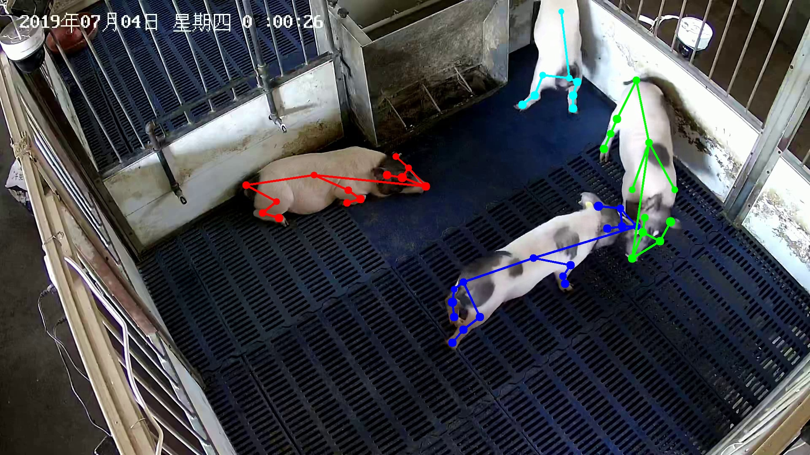

# Pig_Pose_Det
This repository is the official implementation of pig pose detection used in the paper:

An, L., Ren, J., Yu, T., Hai, T., Jia, Y., &Liu, Y. Three-dimensional surface motion capture of multiple freely moving pigs using MAMMAL. *biorxiv* (2022). 

[[project]()] [[paper]()]



Other related repositories: 
* [MAMMAL_core]() 
* [MAMMAL_datasets](https://github.com/anl13/MAMMAL_datasets)
* [MAMMAL_evaluation](https://github.com/anl13/MAMMAL_evaluation) 
* [MAMMAL_behavior](https://github.com/anl13/MAMMAL_behavior) 
* [pig_silhouette_det](https://github.com/anl13/pig_silhouette_det)
* [PIG_model](https://github.com/anl13/PIG_model) 

This code is modified from https://github.com/Microsoft/human-pose-estimation.pytorch. 

## Environments
This code has been tested on Ubuntu 20.04, cuda 11.3 (cudnn 8.2.1), python3.7.13, pytorch 1.12.0, NVIDIA Titan X. Currently, GPU support is necessary. 

Besides, the following environments were also tested: 
* Ubuntu 18.04, cuda 10.1 (cudnn 7.6.5), python 3.6.9, pytorch 1.5.1, NVIDIA RTX 2080 Ti. 

## Install 
1. Clone this repo, and we'll call the directory that you cloned as ${POSE_ROOT}. Simply go to ${POSE_ROOT} by 
```shell
cd ${POSE_ROOT}
```
2. We recommend to use conda to manage the virtual environment. After install conda (follow the official instruction of anaconda), use the commands below to create a virtual python environment. We have tested the code on both python3.7 with the newest `pytorch 1.12.0`. 
```shell
conda create -n PIG_POSE python=3.7
conda activate PIG_POSE
```
3. To install the newest `pytorch` (or old version as you like), you can go to https://pytorch.org/ for more instructions. Here, we used the following commands. Please pay a close attention to the version of `cudatoolkit`, it should match the cuda version of your own machine. In our case, we use cuda 11.3. 
```shell
conda install pytorch torchvision torchaudio cudatoolkit=11.3 -c pytorch
```
4. To install other packages, run 
```
pip install -r requirements.txt
```
5. Then, go to `lib` folder to make libs. 
```
cd lib 
make
cd ..
```
6. Build cocoapi. Note that, DO NOT use the official verision `pycocotools` because we modified `cocoeval.py` to accommodate our [BamaPig2D dataset](https://github.com/anl13/MAMMAL_datasets).
```
cd lib/cocoapi/PythonAPI
python setup.py install 
```
The installation is finished. 
## Petrained weights
Download the pretrained weights (together with training and testing log) from [Google Drive](https://drive.google.com/file/d/1oeYv1hBlEvb0DZuls6e8dmdw_J7Va1Lj/view?usp=sharing) or [Baidu Drive](https://pan.baidu.com/s/1prY2zoSlx9ATDrSF4L8d5g) (extract code: 4pw1), unzip the downloaded `output20210225.zip` to ${POSE_ROOT} folder and you will get:
   ```
   ${POSE_ROOT}
    `-- output20210225
        `-- pig_univ
            `-- pose_hrnet
                `-- w48_384x384_univ_20210225
                    |-- results
                    |-- checkpoint.pth
                    |-- final_state.pth
                    |-- model_best.pth
                    |-- pose_hrnet.py
                    |-- w48_384x384_univ_20210225_2021-02-25-23-28_train.log
   ```
The `model_best.pth` is actually the used pretrained weights. 

## Run demos 
1. Download the [BamaPig3D dataset](https://github.com/anl13/MAMMAL_datasets). Its path is denoted as ${YOUR_DATA_PATH}. Note that, if you have not run [pig_silhouette_det](https://github.com/anl13/pig_silhouette_det) to get the `boxes_pr` folder within the dataset, you could not run this demo because bounding boxes for pigs are necessary. Fortunately, we have provided our own detected bounding boxes within the full version of BamaPig3D dataset, see [https://github.com/anl13/MAMMAL_datasets](https://github.com/anl13/MAMMAL_datasets) for more details. 
2. Change the `--dataset_folder` argument in `demo_BamaPig3D.sh` to ${YOUR_DATA_PATH}.
3. Run `demo_BamaPig3D.sh` with 
```
bash demo_BamaPig3D.sh
```
The `--vis` argument control whether the program shows the output image with keypoints drawn. If the image panel is shown, you can press `ESC` to exit or other keys to move to next image. Note that, only keypoints with a confidence large than 0.5 are shown. You can change this threshold in `pose_estimation/demo_BamaPig3D.py` line 144. 
The `--write_json` would write the output keypoints as json files into `${YOUR_DATA_PATH}/keypoints_hrnet` folder. 

## Train and eval 
### Training
1. To train the network, you should first obtain the [BamaPig2D dataset](https://github.com/anl13/MAMMAL_datasets).  Let's assume your own dataset path is ${YOUR_DATA_2D_PATH}. 
2. Create a symbolic link towards ${YOUR_DATA_2D_PATH} as `data/pig_univ`. The struct is 
   ```
   ${POSE_ROOT}
    `-- data
        `-- pig_univ
            |-- images\
            |-- annotations\
   ```
3. Download weights of hrnet pretrained on ImageNet `hrnet_w48-8ef0771d.pth` from [pytorch model zoo](https://pytorch.org/docs/stable/model_zoo.html#module-torch.utils.model_zoo) and put it to `model` folder as 
   ```
   ${POSE_ROOT}
    `-- models
        `-- pytorch
            `-- imagenet
                `-- hrnet_w48-8ef0771d.pth
   ```
3. Run 
```
bash train.sh 
```
It will write training log and results to `output` folder. The whole training takes about 32 hours on single GPU. It depends on the performance and number of GPU. 

### Evaluation
Run `test.sh` as the following will perform evaluation on our pretrained model (see demos before).
```
bash test.sh
```
This command will write a validation log to `output20210225/pig_univ/pose_hrnet/w48_384x384_univ_20210225/`. You can also change the cfg file in `test.sh` to perform evalution on your own trained results. 
As a baseline, our pretrained model performs: 
| Arch | AP | Ap .5 | AP .75 | AP (M) | AP (L) | AR | AR .5 | AR .75 | AR (M) | AR (L) |
|---|---|---|---|---|---|---|---|---|---|---|
| pose_hrnet | 0.633 | 0.954 | 0.730 | 0.000 | 0.633 | 0.694 | 0.961 | 0.791 | 0.000 | 0.695 |

### Output 
The output is 23 keypoints, where only 19 are non-zero valid ones. See [BamaPig2D dataset](https://github.com/anl13/MAMMAL_datasets) for more explanations. 

## Citation
If you use this code in your research, please cite the paper 
```
@article{MAMMAL, 
    author = {An, Liang and Ren, Jilong and Yu, Tao and Jia, Yichang and Liu, Yebin},
    title = {Three-dimensional surface motion capture of multiple freely moving pigs using MAMMAL},
    booktitle = {biorxiv},
    month = {July},
    year = {2022}
}
```

## Contact 
* Liang An (al17@mails.tsinghua.edu.cn)
